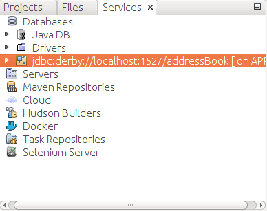

# Address Book

This is an Address Book with a Simple GUI built using Java.

## Instructions to Use the Application

### Home Page

When the application is launched, the first page(Home Page) is displayed. It has three buttons. 
The "Add" Button, the "Delete" Button and the "Search" Button.

### Add Record Page

When the "Add" button in the Home Page is clicked, the window to add the element pops up.
The "ID" field is not editable and is unique for each contact. The rest of the Details **must** be filled.
Once all the fields are filled, click on the "Add" button. If the contact is successfully added, the window will close, else it will stay open.
If data is not being saved, make sure that all the fields are filled. Click on the "Back" button to return to the Home Page.

### Delete Record Page

When the "Delete" button is clicked on the Home Page, the Delete record window pops up. Enter the "ID" of the record you want to delete.
When the ID is entered, the Name of the ID is displayed. Complete the deletion process by clicking on the "Delete" button.
The window will close when the record is successfully deleted. If the window does not close, Check the IS you entered. Click on the "Back" button to return to the Home Page.

### Search Records Page

When the "Search" button is clicked on the Home Page, the Search Record window pops up.
Enter values in any number of the text fields to show the records that have the details you entered in common.
Click on the "Back" button to return to the Home Page.

## Instructions before compiling/running the code
* Make sure the Derby Database is running in the host as mentioned in the [code](https://github.com/BBloggsbott/Address-Book/blob/master/src/dbmanager/DBHandler.java).
* If you are using an IDE to run the code make sure that the addressBook Database is connected. If not, Right
click on that Database and connect it. In NetBeans, when connected it should look like this:

 

##Guidelins for contributors

Please follow the [Pull Request Template](https://github.com/BBloggsbott/Address-Book/blob/master/PULL_REQUEST_TEMPLATE.md1111) while making a PR.

**To view the Javadoc, [Click here](https://bbloggsbott.github.io/Address-Book/)**
